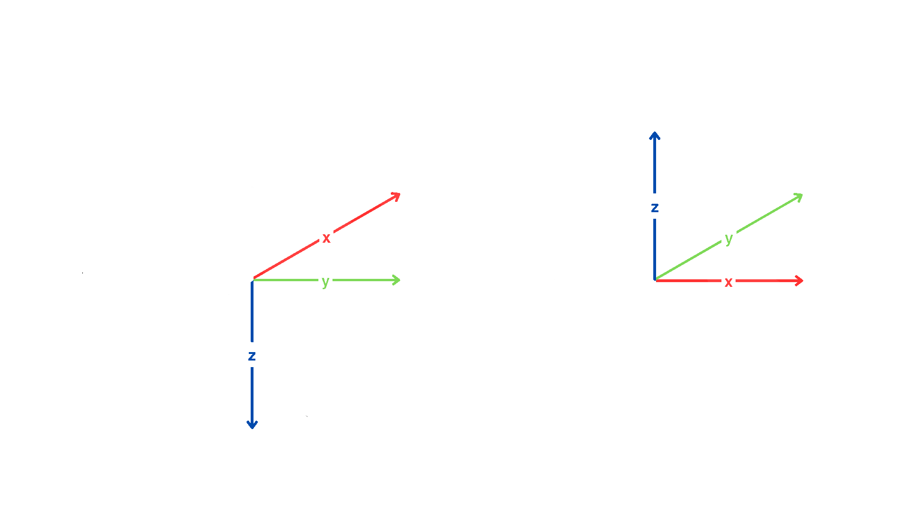

# Coordinate Conventions and Convention Conversions

## Definitions
- **Rotation quaternion:** A quaternion representing a rotation transformation.
- **Orientation quaternion:** A quaternion representing a orientation in respect to a specific coordinate frame.
- **Change of basis quaternion:** A rotation quaternion $q_{B \rightarrow F}$, which when right multiplied by an orientation quaternion $b$ in the $B$ frame, results in an orientation quaternion $f$ represnting the same orientation in the $F$ frame. 
    
$$
f = b \cdot q_{B \rightarrow F}
$$

## NED and ENU
NED (North East Down) and ENU (East North Up) are reference frame conventions defined based on Earth-centered/Earth-fixed coordinates. 
NED frame contains three orthogonal axes in which North is $+x$, East is $+y$, and down is $+z$. Similarly, ENU frame contains three orthogonal axes, but in this case East is $+x$, North is $+y$, and Up is $+z$.

## NED to ENU Util
The `Ros2QuatConvert` class in `utils/quaternion_utils.py` file contains functionality to convert orientation quaternions between NED and ENU coordinate frames.
### Methodology
1. We define $B_{ENU \leftarrow NED}$ as the change of basis matrix from NED to ENU:

$$
B_{ENU \leftarrow NED} = \begin{pmatrix}
                0 & 1 & 0\\
                1 & 0 & 0\\
                0 & 0 & -1
                \end{pmatrix} 
$$

2. $B_{ENU \leftarrow NED}$ is converted to a rotation quaternion $q_{ENU \leftarrow NED}$:

$$
q_{ENU \leftarrow NED} = (0, \sqrt{2}/2, \sqrt{2}/2, 0)
$$

3. Then any orientation quaternion $q_{NED}$ in NED coordinates can be converted to the equivalent orientation quaternion in ENU coordinates by quaternion multiplication:
    
$$
q_{ENU} = q_{ENU \leftarrow NED} \cdot q_{NED}
$$

4. Similarly, any orientation quaternion $q_{ENU}$ in ENU coordinates can be converted to the equivalent orientation quaternion in ENU coordinates by quaternion multiplication with the conjugate of $q_{ENU \leftarrow NED}$:
    
$$
q_{ENU} = q_{ENU \leftarrow NED}' \cdot q_{NED}
$$

### Testing methodology
TODO 

## Sources and resources
- [Quaternions and spatial rotation](https://en.wikipedia.org/wiki/Quaternions_and_spatial_rotation)
- [Local tangent plane coordinates](https://en.wikipedia.org/wiki/Local_tangent_plane_coordinates)
- [Quaternion Visualizer](https://quaternions.online/)